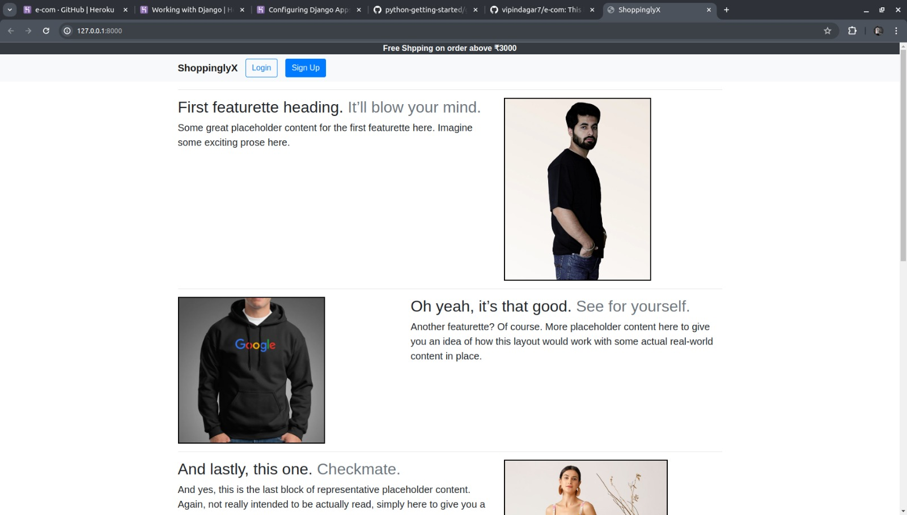
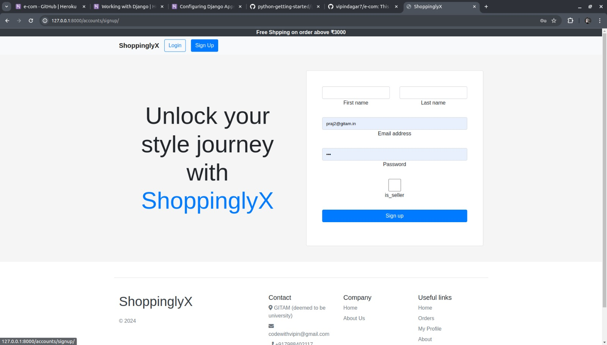
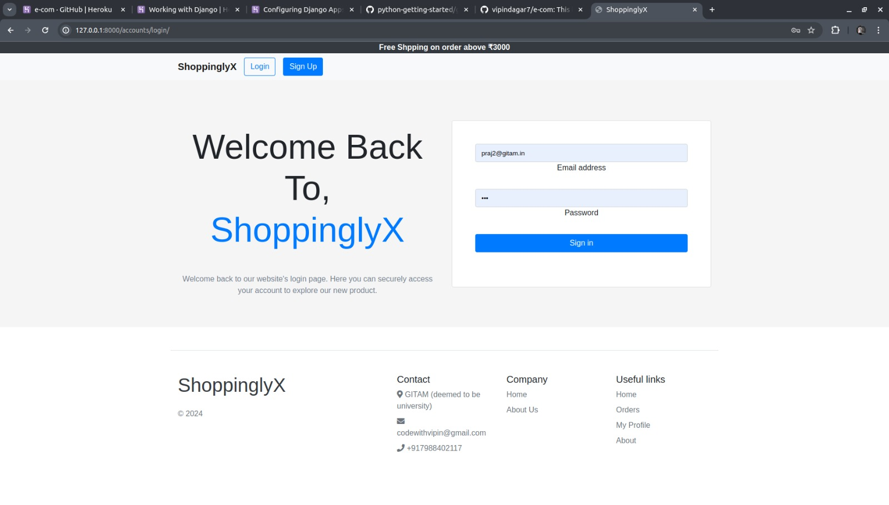
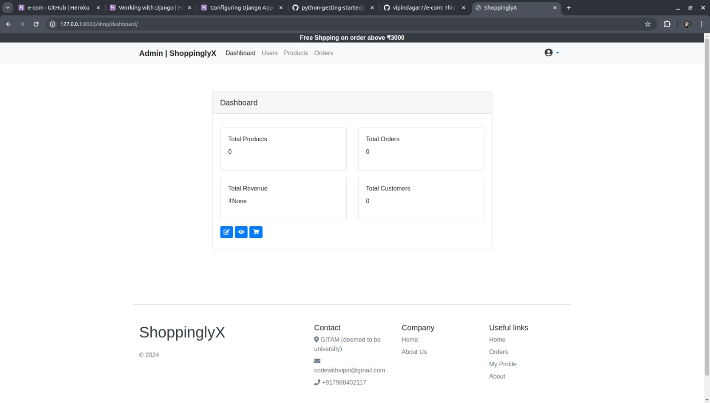
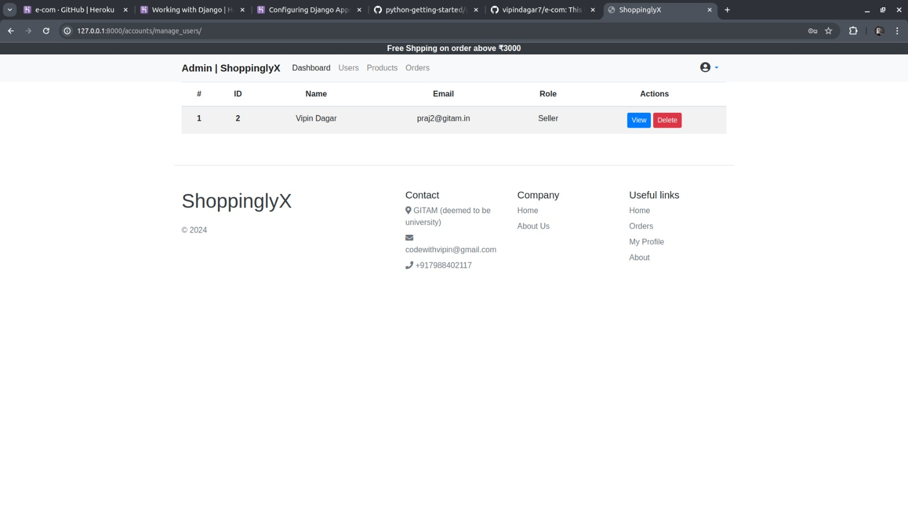
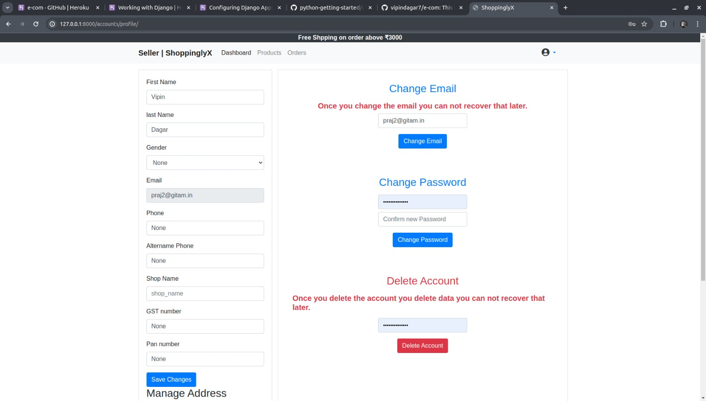

# 🛍️ ShopinglyX

ShopinglyX is an online platform revolutionizing secondhand fashion discovery. Our platform offers a meticulously curated selection of pre-loved clothing and accessories, fostering a conscious and style-driven community.

## 🌟 Features

- **Discover Unique Fashion Pieces**: Explore a diverse array of one-of-a-kind fashion items curated for you.
- **Personalized Profiles**: Showcase your unique style preferences and favorite finds.
- **Sustainability Focus**: Embrace eco-consciousness through the magic of secondhand fashion.
- **Social Media Integration**: Seamlessly share your favorite finds with your friends and followers.

## 🚀 Getting Started

1. **Clone the Repository**: `git clone https://github.com/vipindagar7/eCommerce.git`
2. **Install Dependencies**: `pip install -r requirements.txt`
3. **Database Setup**: Configure your database settings in `settings.py`.
4. **Run Migrations**: `python manage.py migrate`
5. **Start the Server**: `python manage.py runserver`
6. **Explore and Enjoy**: Visit `http://localhost:8000` in your browser and start discovering unique fashion finds!

## 🖼️ Preview

## 🤝 Contributing

We welcome contributions to ShopinglyX! To contribute, please follow these steps:

1. Fork the repository.
2. Create a new branch (`git checkout -b feature/your-feature-name`).
3. Make your changes.
4. Commit your changes (`git commit -am 'Add some feature'`).
5. Push to the branch (`git push origin feature/your-feature-name`).
6. Create a new Pull Request.

## 📃 License

This project is licensed under the MIT License. See the [LICENSE](LICENSE) file for details.

